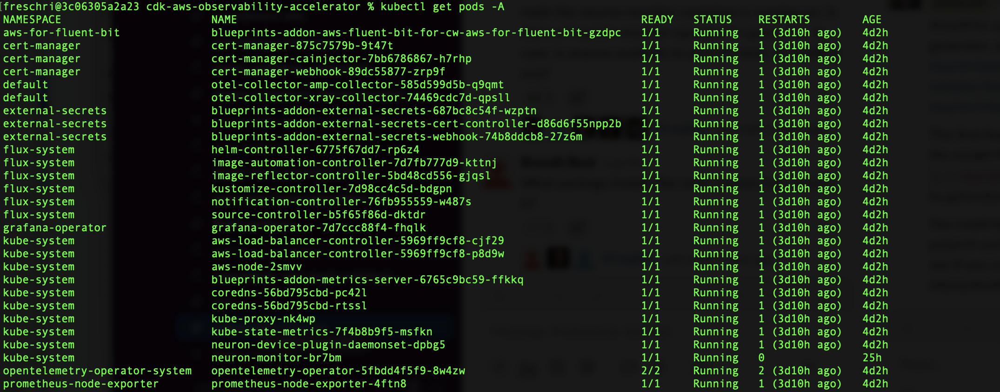
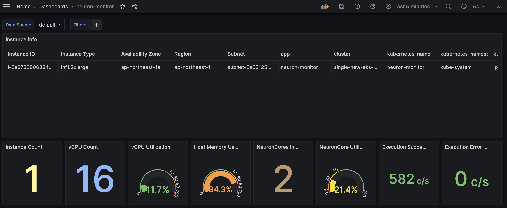

# Single New EKS Cluster Open Source Observability Accelerator for Neuron-based clusters

[AWS Trainium](https://aws.amazon.com/machine-learning/trainium/) and [AWS Inferentia](https://aws.amazon.com/machine-learning/inferentia/) are accelerated Machine Learning (ML) chips (or ML accelerators), designed and built by AWS. They are also referred to as Neuron Devices. Each Neuron device includes multiple NeuronCores, the machine learning compute cores.

Amazon EC2 ML instances belong to the [Trn1/Trn1n](https://aws.amazon.com/ec2/instance-types/trn1/), [Inf1](https://aws.amazon.com/ec2/instance-types/inf1/) and [Inf2](https://aws.amazon.com/ec2/instance-types/inf2/) families. Trn1/Trn1n instances feature multiple AWS Trainium accelerators and support high-performance training. Inf1 and Inf2 instances feature multiple AWS Inferentia accelerators and support high-performance and low-latency inference.

[AWS Neuron](https://awsdocs-neuron.readthedocs-hosted.com/en/latest/) is an SDK with a compiler, runtime, and profiling tools that helps developers deploy models on both AWS Inferentia accelerators and train them on AWS Trainium accelerators. It integrates natively with popular ML frameworks, such as PyTorch and TensorFlow.

This pattern shows you how to monitor the performance of ML accelerators, used in an Amazon EKS cluster leveraging Inferentia-based Amazon EC2 Inf1 instances. The pattern will also be applicable to Inf2 and Trn1/Trn1n instances soon, when AWS Cloud Development Kit (CDK) completes support for Inf2 and Trn1/Trn1n (in progress, at the time of writing).

Amazon Managed Service for Prometheus and Amazon Managed Grafana are open source tools used in this pattern to collect and visualise metrics respectively.

Amazon Managed Service for Prometheus is a Prometheus-compatible service that monitors and provides alerts on containerized applications and infrastructure at scale.

Amazon Managed Grafana is a managed service for Grafana, a popular open-source analytics platform that enables you to query, visualize, and alert on your metrics, logs, and traces.

## Objective

This pattern deploys an Amazon EKS cluster with a node group that includes Inf1 instances.

The AMI type of the node group is `AL2_x86_64_GPU AMI`, which uses the [Amazon EKS-optimized accelerated AMI](https://aws.amazon.com/marketplace/pp/prodview-nwwwodawoxndm). In addition to the standard Amazon EKS-optimized AMI configuration, the accelerated AMI includes the AWS Neuron container runtime.

The Neuron container runtime consists of kernel driver and C/C++ libraries which provide APIs to access Inferentia and Trainium Neuron devices. The Neuron ML frameworks plugins for TensorFlow, PyTorch and Apache MXNet use the Neuron runtime to load and run models on the NeuronCores.

To access Neuron cores & devices from Kubernetes, the pattern deploys the Neuron device plugin, which exposes Neuron cores & devices to Kubernetes, as resources.

Neuron metrics are exposed to Amazon Managed Service for Prometheus by the `neuron-monitor` DaemonSet, which deploys a minimal container, with the [Neuron Tools](https://awsdocs-neuron.readthedocs-hosted.com/en/latest/tools/index.html) installed. Specifically, the container runs the `neuron-monitor`(https://awsdocs-neuron.readthedocs-hosted.com/en/latest/tools/neuron-sys-tools/neuron-monitor-user-guide.html#neuron-monitor-ug) command piped into the `neuron-monitor-prometheus.py` companion script:

```bash
neuron-monitor | neuron-monitor-prometheus.py --port <port>
```

`neuron-monitor` collects metrics and stats from the Neuron Applications running on the system and streams the collected data to stdout [in JSON format](https://awsdocs-neuron.readthedocs-hosted.com/en/latest/tools/neuron-sys-tools/neuron-monitor-user-guide.html#the-json-output-format).

`neuron-monitor-prometheus.py` maps and exposes the telemetry data from JSON format into Prometheus compatible format.

Data is visualised in Amazon Managed Grafana by the corresponding dashboard.

The rest of the setup to collect and visualise metrics with Amazon Managed Service for Prometheus and Amazon Managed Grafana, is similar to that used in other open-source based patterns, included in this repository.

## Prerequisites:

Ensure that you have installed the following tools on your machine.

1. [aws cli](https://docs.aws.amazon.com/cli/latest/userguide/install-cliv2.html)
2. [kubectl](https://Kubernetes.io/docs/tasks/tools/)
3. [cdk](https://docs.aws.amazon.com/cdk/v2/guide/getting_started.html#getting_started_install)
4. [npm](https://docs.npmjs.com/cli/v8/commands/npm-install)

## Deploying

1. Clone your forked repository

```sh
git clone https://github.com/aws-observability/cdk-aws-observability-accelerator.git
```

2. Install the AWS CDK Toolkit globally on your machine using

```bash
npm install -g aws-cdk
```

3. Amazon Managed Grafana workspace: To visualize metrics collected, you need an Amazon Managed Grafana workspace. If you have an existing workspace, create an environment variable as described below. To create a new workspace, visit [our supporting example for Amazon Managed Grafana](https://aws-observability.github.io/terraform-aws-observability-accelerator/helpers/managed-grafana/)

!!! note
    For the URL `https://g-xyz.grafana-workspace.us-east-1.amazonaws.com`, the workspace ID would be `g-xyz`

```bash
export AWS_REGION=<YOUR AWS REGION>
export COA_AMG_WORKSPACE_ID=g-xxx
export COA_AMG_ENDPOINT_URL=https://g-xyz.grafana-workspace.us-east-1.amazonaws.com
```

!!! warning
    Setting up environment variables `COA_AMG_ENDPOINT_URL` and `AWS_REGION` is mandatory for successful execution of this pattern.

4. GRAFANA API KEY: Amazon Managed Grafana provides a control plane API for generating Grafana API keys.

```bash
export AMG_API_KEY=$(aws grafana create-workspace-api-key \
  --key-name "grafana-operator-key" \
  --key-role "ADMIN" \
  --seconds-to-live 432000 \
  --workspace-id $COA_AMG_WORKSPACE_ID \
  --query key \
  --output text)
```

5. AWS SSM Parameter Store for GRAFANA API KEY: Update the Grafana API key secret in AWS SSM Parameter Store using the above new Grafana API key. This will be referenced by Grafana Operator deployment of our solution to access Amazon Managed Grafana from Amazon EKS Cluster

```bash
aws ssm put-parameter --name "/cdk-accelerator/grafana-api-key" \
    --type "SecureString" \
    --value $AMG_API_KEY \
    --region $AWS_REGION
```

6. Install project dependencies by running `npm install` in the main folder of this cloned repository. 

7. The actual settings for dashboard urls and EKS managed node group are expected to be specified in the CDK context. Generically it is inside the cdk.json file of the current directory or in `~/.cdk.json` in your home directory.

Example settings: Update the context in `cdk.json` file located in `cdk-eks-blueprints-patterns` directory

```typescript
  "context": {
    "fluxRepository": {
      "name": "grafana-dashboards",
      "namespace": "grafana-operator",
      "repository": {
        "repoUrl": "https://github.com/aws-observability/aws-observability-accelerator",
        "name": "grafana-dashboards",
        "targetRevision": "main",
        "path": "./artifacts/grafana-operator-manifests/eks/infrastructure"
      },
      "values": {
        "GRAFANA_CLUSTER_DASH_URL" : "https://raw.githubusercontent.com/aws-observability/aws-observability-accelerator/main/artifacts/grafana-dashboards/eks/infrastructure/cluster.json",
        "GRAFANA_KUBELET_DASH_URL" : "https://raw.githubusercontent.com/aws-observability/aws-observability-accelerator/main/artifacts/grafana-dashboards/eks/infrastructure/kubelet.json",
        "GRAFANA_NSWRKLDS_DASH_URL" : "https://raw.githubusercontent.com/aws-observability/aws-observability-accelerator/main/artifacts/grafana-dashboards/eks/infrastructure/namespace-workloads.json",
        "GRAFANA_NODEEXP_DASH_URL" : "https://raw.githubusercontent.com/aws-observability/aws-observability-accelerator/main/artifacts/grafana-dashboards/eks/infrastructure/nodeexporter-nodes.json",
        "GRAFANA_NODES_DASH_URL" : "https://raw.githubusercontent.com/aws-observability/aws-observability-accelerator/main/artifacts/grafana-dashboards/eks/infrastructure/nodes.json",
        "GRAFANA_WORKLOADS_DASH_URL" : "https://raw.githubusercontent.com/aws-observability/aws-observability-accelerator/main/artifacts/grafana-dashboards/eks/infrastructure/workloads.json",
        "GRAFANA_NEURON_DASH_URL" : "https://raw.githubusercontent.com/aws-observability/aws-observability-accelerator/main/artifacts/grafana-dashboards/eks/neuron/neuron-monitor.json"
      },
      "kustomizations": [
        {
          "kustomizationPath": "./artifacts/grafana-operator-manifests/eks/infrastructure"
        },
        {
          "kustomizationPath": "./artifacts/grafana-operator-manifests/eks/neuron"
        }
      ]
    },
     "neuronNodeGroup": {
      "instanceClass": "inf1",
      "instanceSize": "2xlarge",
      "desiredSize": 1, 
      "minSize": 1, 
      "maxSize": 3,
      "ebsSize": 512
    },
  }
```

**Note**: insure your selected instance type is available in your selected region. To check that, you can run the following command (amend `Values` below as you see fit):

```bash
aws ec2 describe-instance-type-offerings \
    --filters Name=instance-type,Values="inf1*" \
    --query "InstanceTypeOfferings[].InstanceType" \
    --region us-east-2
```

8. For the `neuron-monitor` DaemonSet, you can either use the image already referenced into the manifest, or build your own using the Dockerfile at location `cdk-aws-observability-accelerator/lib/common/resources/neuron/neuron-monitor.dockerfile`, [push it to an ECR repository](https://docs.aws.amazon.com/AmazonECR/latest/userguide/docker-push-ecr-image.html) of your choice and update the image URL in the manifest at location `cdk-aws-observability-accelerator/lib/single-new-eks-opensource-observability-pattern/neuron/neuron-monitor.yaml`.

9. Once all pre-requisites are set you are ready to deploy the pipeline. Run the following command from the root of this repository to deploy the pipeline stack:

```bash
make build
make pattern single-new-eks-neuron-opensource-observability deploy
```

## Verify the resources

Run update-kubeconfig command. You should be able to get the command from CDK output message.

```bash
aws eks update-kubeconfig --name single-new-eks-neuron-opensource-observability-accelerator --region <your region> --role-arn arn:aws:iam::xxxxxxxxx:role/single-new-eks-neuron-opensource-singleneweksgpuopensourc...
```

Let’s verify the resources created by steps above:

```bash
kubectl get pods -A
```

Output:



Specifically, insure `neuron-device-plugin-daemonset` DaemonSet is running:

```bash
kubectl get ds neuron-device-plugin-daemonset --namespace kube-system
```

Output:

```bash
NAME                             DESIRED   CURRENT   READY   UP-TO-DATE   AVAILABLE   NODE SELECTOR   AGE
neuron-device-plugin-daemonset   1         1         1       1            1           <none>          2h
```

And also that `neuron-monitor` DaemonSet is running:


```bash
kubectl get ds neuron-monitor --namespace kube-system
```

Output:

```bash
NAME             DESIRED   CURRENT   READY   UP-TO-DATE   AVAILABLE   NODE SELECTOR   AGE
neuron-monitor   1         1         1       1            1           <none>          2h
```

Next, let's verify that Neuron devices and cores are visible, by running [`neuron-ls`](https://awsdocs-neuron.readthedocs-hosted.com/en/latest/tools/neuron-sys-tools/neuron-ls.html) and [`neuron-top`](https://awsdocs-neuron.readthedocs-hosted.com/en/latest/tools/neuron-sys-tools/neuron-top-user-guide.html) commands from e.g. your neuron-monitor pod:

```bash
kubectl exec -it {your neuron-monitor pod} -- /bin/bash -c "neuron-ls"
```

Output:


```bash
kubectl exec -it {your neuron-monitor pod} -- /bin/bash -c "neuron-top"
```

Output:


## Visualization

### Grafana Neuron Dashboard

Login to your Amazon Managed Grafana workspace and navigate to the Dashboards panel. You should see a dashboard named `Neuron / Monitor`.

To actually see some interesting metrics on the Grafana dashboard, we will apply the following manifest:

```bash
kubectl apply -f ./lib/common/resources/neuron/pytorch-inference-resnet50.yml
```

This is just a sample workload that compiles [Resnet/Pytorch](https://github.com/aws-neuron/aws-neuron-samples/blob/master/torch-neuron/inference/resnet/Resnet.ipynb) and runs repetitive inference in a loop to generate telemetry data.

To verify the Pod was successfully deployed, please run:

```bash
kubectl get pods
```

You should see a pod named `pytorch-inference-resnet50`.

After a few minutes, looking into the `Neuron / Monitor`, you should see the gathered metrics, similar to: 




Grafana Operator and Flux always work together to synchronize your dashboards with Git. If you delete your dashboards by accident, they will be re-provisioned automatically.
    
## Teardown

You can teardown the whole CDK stack with the following command:

```bash
make pattern single-new-eks-neuron-opensource-observability destroy
```
